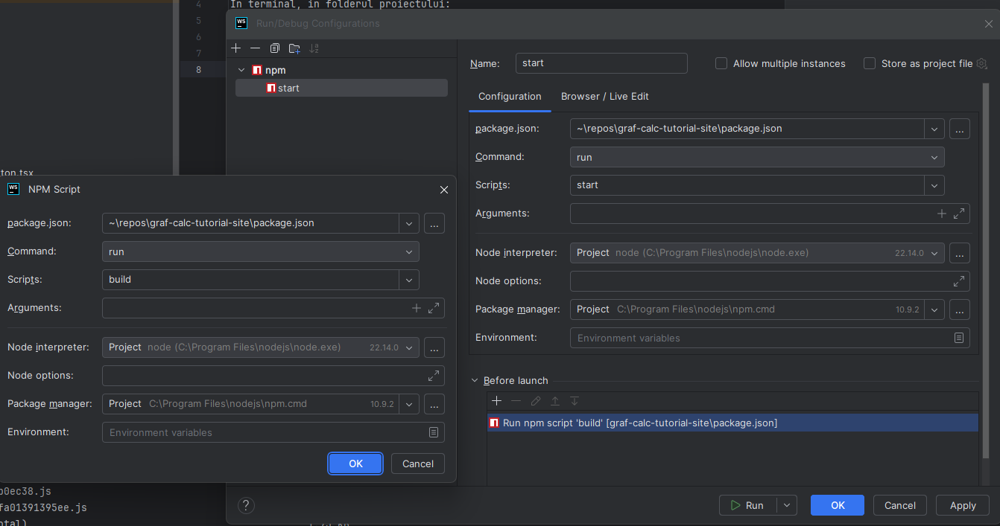

# Intro

## Rulare Proiect
In terminal, in folderul proiectului:
```
npm run build
npm run start
```

## Configuratie IDE WebStrom
De asemenea, se poate crea o configuratie de rulare ca in imaginea de mai jos:
